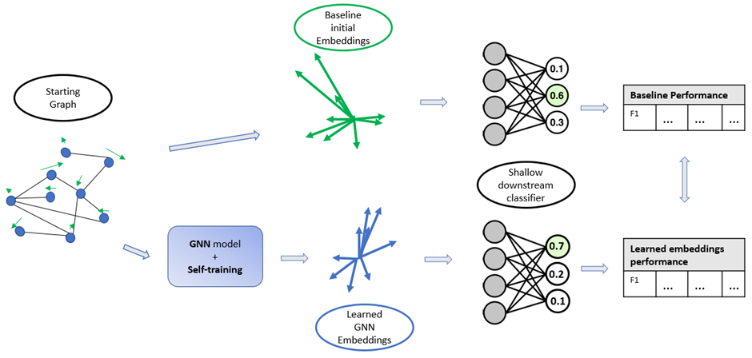

# Self-Training Graph Semantic Embeddings
Code and Dataset for the journal paper _Enhancing Social Media User Semantic Embedding through Graph-Aware Contrastive Self-Supervised Learning_ (IEEE Access 2024)


## Datasets
- Twitter Neighbour Dataset for model pre-training available at [hf.co/datasets/links-ads/twitter-neighbours](https://huggingface.co/datasets/links-ads/twitter-neighbours).
- Hateful Users on Twitter dataset: https://paperswithcode.com/dataset/hateful-users-on-twitter
- ConvinceME dataset: https://nlds.soe.ucsc.edu/iac2

## Self-Training
Once the dataset is downloaded, save it inside the `datasets` directory, it should be named `TwitterNeighbours`. You can use a custom name if you prefer, in that case however you will need to update the ```src.config.data.DataConfig``` configuration files.

Once ready, you can launch a training with the following commands:

```console
$ CUDA_VISIBLE_DEVICES=... python train.py [CONFIGS]
```

## Produce graph semantic embeddings
After having loaded your graph data into from `torch_geometric.data import Data`
```python
from src.model import samGAT
embs = samGAT(x=graph_data.x, edge_index=graph_data.edge_index.contiguous())
```

where `graph_data.x` are the initial representation for each node (in case of social media users it could be the average text embeddings of the user post)


## Archetypes for hateful users few-shot
In the folder `data/AppraieEval/archetypes` archetypes for hatefull users can be found.
here there are 4 files:
- `hate_archetypes_neighbours.json` archetypes of users connections;
- `hate_archetypes_and_neighs_tweet_embeddings.json` average post embeddings of each archetype and connected user;
- `hate_archetypes_initial_embeddings.json` initial embeddings for just archetype users;
- `hate_archetypes_graph_embeddings` graph embedding for archetypes (computed with ```samGATs```)
<br/><br/>
The graph semantic embeddings of the archetypes can be used, as mentioned in the paper, to estimate a score for hatefulness of a new user, as long as the graph model used to embed archetypes and user is the same.

## Citing this work
```bibtex


